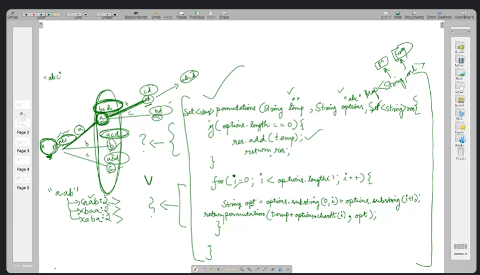
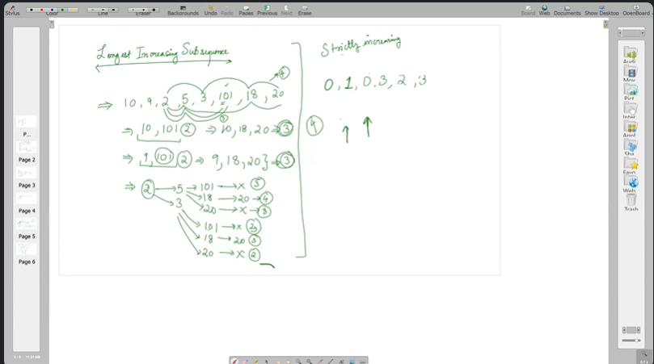

## Questions:
- Permutations of strings
https://www.geeksforgeeks.org/problems/permutations-of-a-given-string2041/1?itm_source=geeksforgeeks&itm_medium=article&itm_campaign=bottom_sticky_on_article

- Large increasing subsequences
https://leetcode.com/problems/longest-increasing-subsequence/description/
